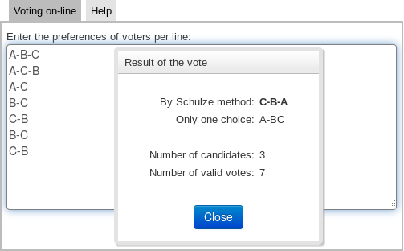

# Schulze voiting web calculator

A [Schulze method](https://en.wikipedia.org/wiki/Schulze_method) is a electoral
system by Markus Schulze that selects a single winner using votes that express preferences.
This web project is a simple web calculator based on Schulze method developed
using language Java 8 and GWT framework and so the result is calculated on the
client side always. All important methods are covered by jUnit tests and
some results are compared with a real samples from wiki.

## Screenshot

> 

## Running the project

1. install an [Apache Maven](https://maven.apache.org/) tool
    with [Java Development Kit 1.8+](www.oracle.com/technetwork/java/javase/downloads/)
2. clone this project to an empty directory of the local filesystem
3. in the root of project directory call statement `mvn install -DskipTests` to compile the project
4. run the application by the statement: `mvn gwt:run`

## Live application

You can use also the next link to the live application with an english language:
[http://schulz.webfort.cz?locale=en](http://schulz.webfort.cz?locale=en)

## Application license

Copyright 2017, Pavel Ponec, [https://github.com/pponec/](https://github.com/pponec/)

Licensed under the Apache License, Version 2.0 (the "License");
you may not use this file except in compliance with the License.
You may obtain a copy of the License at

> [http://www.apache.org/licenses/LICENSE-2.0](http://www.apache.org/licenses/LICENSE-2.0)

Unless required by applicable law or agreed to in writing, software
distributed under the License is distributed on an "AS IS" BASIS,
WITHOUT WARRANTIES OR CONDITIONS OF ANY KIND, either express or implied.
See the License for the specific language governing permissions and
limitations under the License.

-- EOF
