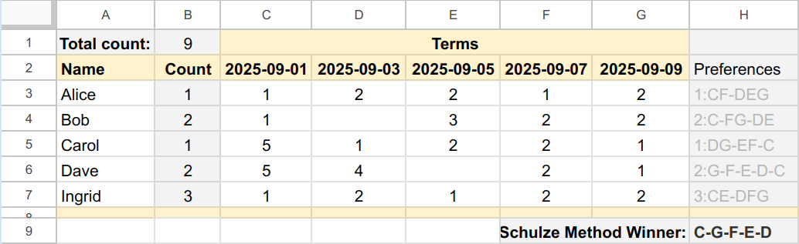

# Schulze voiting web calculator


A [Schulze method](https://en.wikipedia.org/wiki/Schulze_method) is a electoral
system by Markus Schulze that selects a winner using votes that express preferences.
The method is considered one of the best methods for handling preferential voting.
This web project is a simple web calculator based on Schulze method developed
using language Java 8 and GWT framework and so the result is calculated on the
client side always. All important methods are covered by jUnit tests and
some results are compared with a real samples from the Wikipedia.


## Screenshot

> 

## Live application

You can use [live application](http://schulz.webfort.cz) to get started, the language localization is taken automatically from the internet browser.
If you prefer the explicit English language, use [this link](http://schulz.webfort.cz?locale=en).

## Input data format

Each row indicates one electoral preference.
The leading number (separated by a colon separator) indicates how many votes the option represents. 
The number is optional, the default value is one vote.
The following is a sample of voter preferences:

```text
8:A-BC
5:B-C-A
9:Z
```

From such an input, the Calculator shows the following result:

```text
By Schulze method: A-B-C-Z
By Borda Count method: B-A-C-Z
Only one choice: Z-A-B-C
Number of candidates: 4
Number of valid votes: 22
```

As you can see, each method can determine a different winner.


## Borda Count method

For the purpose of comparison, the applicaton calculates also the winner 
according to the [Borda Count](https://en.wikipedia.org/wiki/Borda_count) method.
This method has the advantage of simpler calculation, but is more susceptible to manipulation in strategic voting. 
Especially when there are highly polarized groups.


## First-preference plurality    

The result of this method shows the outcome of the election as it would be if one voter was allowed to support only one candidate.
Note that the winner did not even reach the semi-finals in the previous two methods.

## Voiting in Google Sheets

The data source for the Calculator can be obtained in a Google Sheets document, which can be used for simple voiting. 
In the following example, the voter has a single line in which to enter their name, the number of votes they represent and their priority.
The value of the numbers is not significant, only the order.
The last line compiles the priority in a format that can be entered into the Calculator. 
However, you must use the user document function to build it.


> 

You can get the input data to the Schulze calculator from Google Sheet document
using the [user function](https://developers.google.com/apps-script/guides/sheets/functions):


```javascript
/**
 * Preference input data builder. Usage in the cell: `=PREFERENCES(B3;"B";C3:G3; 3)`
 * @param {number} count Number of voters per ballot.
 * @param {string} firstColName A character of the first elected candidate.
 * @param {array} array Array of preferences.
 * @param {number} defValue A default priority.
 * @return The input multiplied by 2.
 * @customfunction
*/
function PREFERENCES(count, firstColName, array, defValue) {...}
```

The full code [is here](docs/Preferences.js).
To the `H3` cell write the next formula: `=PREFERENCES(B3;"B";C3:G3; 3)`.
In the next cell, increase the index, and so on.

## Running the project on the local computer

1. install [Java Development Kit 1.8+](www.oracle.com/technetwork/java/javase/downloads/)
2. clone this project to an empty directory of the local filesystem
3. in the root of project directory call statement `./mvnw install -DskipTests` to compile the project
4. run the application by the statement: `./mvnw gwt:run`


## Internet resources

* [Schulze method on Wikipedia](https://en.wikipedia.org/wiki/Schulze_method)
* [Borda Count method on Wikipedia](https://en.wikipedia.org/wiki/Borda_count)
* [Various methods of Condorcet](https://www.condorcet.vote/Condorcet_Methods)


## Application license

Copyright 2017-2024, Pavel Ponec, [https://github.com/pponec/](https://github.com/pponec/)

Licensed under the Apache License, Version 2.0 (the "License");
you may not use this file except in compliance with the License.
You may obtain a copy of the License at

> [http://www.apache.org/licenses/LICENSE-2.0](http://www.apache.org/licenses/LICENSE-2.0)

Unless required by applicable law or agreed to in writing, software
distributed under the License is distributed on an "AS IS" BASIS,
WITHOUT WARRANTIES OR CONDITIONS OF ANY KIND, either express or implied.
See the License for the specific language governing permissions and
limitations under the License.


-- EOF